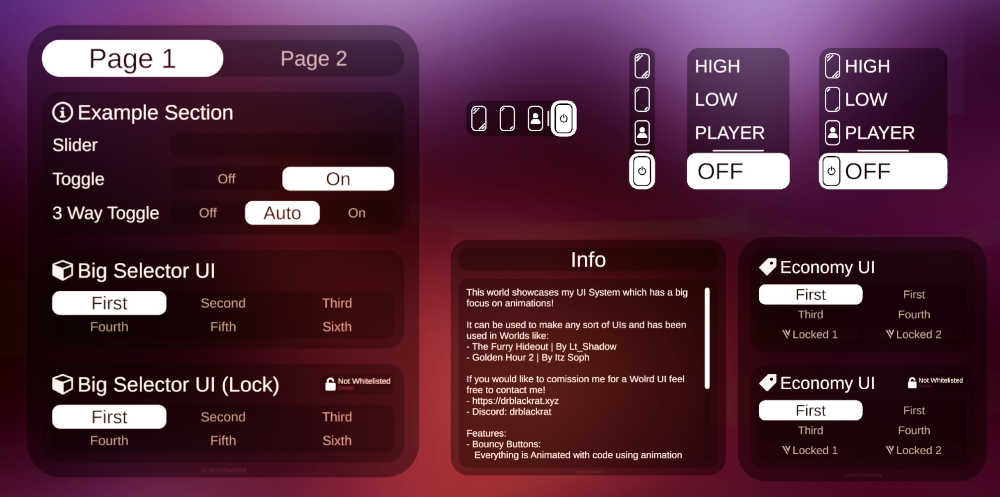

# ✨ About Modern UIs

**Modern UIs** is a collection of scripts, prefabs, and UI elements made to build clean, modern-looking UIs in VRChat. It’s built with a strong focus on animations and smooth interactions, so everything feels satisfying and responsive to use.

You might’ve seen this system used in worlds like the [Furry Hideout](https://vrchat.com/home/world/wrld_4b341546-65ff-4607-9d38-5b7f8f405132/info) or Golden Hour 2.

## 💭 Why did I make this?

For the most part, I was just annoyed by the state of a lot of world UIs in VRChat and wanted to see if I could make something better.

Originally, this project only had a few different mirror UIs, but it’s grown a lot over time and now includes a bunch of different prefabs and scripts.

## 🌐 Demo World

If you want to try out Modern UIs and see if you like it, you can visit the [Demo World](https://vrchat.com/home/world/wrld_9da99c69-cbc1-49bf-8a9c-05f0fc7a329a/info)!

## ⚙️ Features

:::info

**Modern UIs is still in development**, so things may change over time::
- Some features might get removed or updated
- New features are likely to be added
- A few parts of the docs might be out of date

:::

Modern UIs offers **a lot** of features including but not limited to:
- General:
    - Easy to use Persistence Support
    - Local & Networked Toggles / Multi Select Menus
    - Easy expandability with Unity's Layout Components
    - Drag and Drop functionality with Prefabs
- [UI Prefabs](./prefabs):
    - Tabbed Menu to switch between different Menu Pages
    - Sliders & Toggles
        - Standalone & Inside Top UI
    - Multi Select Menus
        - with / without a lock button
    - Mirror UIs in different styles
    - Whitelist Name Display
    - Adding / Removing Users on a Whitelist
    - Scrollable Menu
- [UI Scripts](./scripts):
    - Selector UI to smoothly switch between different states
        - Has Whitelist, Networking and Locking Support
        - Has Persistence Persistence Support
    - Slider UI
        - Easy to use Sliders for Post Processing
        - - Has Persistence Persistence Support
    - Tab Switcher to smoothly switch between Tabs
    - UI Distance Hider to disable menus if you aren't close
    - UI Zones to move a Menu to different places on a map

This is just a quick overview of what it offers! For more details, check out the [Scripts](./scripts) and [Prefabs](./prefabs) sections.

    

