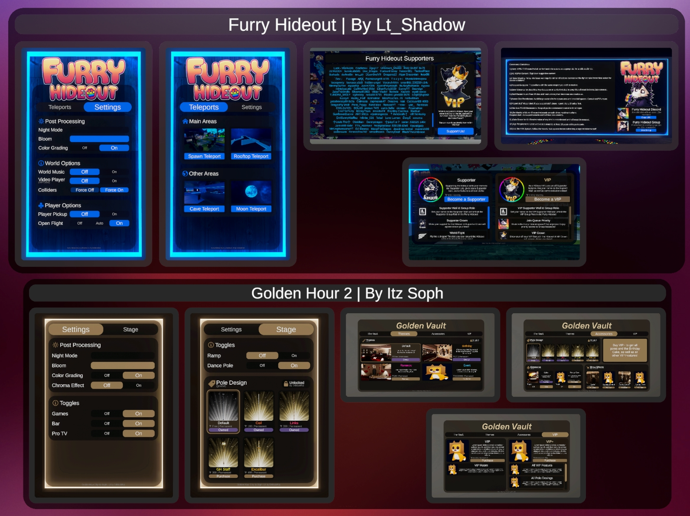

# 📦 Installation

This page covers how to get and install Modern UIs.

## 🔽 How to get Modern UIs

Modern UIs isn’t available as a public download just yet. If you want access, there are two ways to get it:
- You can either **commission** me for a custom UI setup, 
- or get the **standalone** package with a custom quote.

### 🎨 Commission 

If you want a fully custom UI for your VRChat world, you can commission me to make one!

Just reach out to me on Discord: **drblackrat**

#### Includes:
- All of my default prefabs and scripts
- A demo scene tailored to your custom UI
- UI design based on your needs
- Custom scripts (if needed)
- Help with setup

#### Previous Work:

I've previously made UIs for Worlds like the [Furry Hideout](https://vrchat.com/home/world/wrld_4b341546-65ff-4607-9d38-5b7f8f405132/info) and the Golden Hour 2.

### 📁 Standalone

If you instead just want access to my [scripts](../scripts/) and [prefabs](../prefabs/), like what you see in the [demo world](https://vrchat.com/home/world/wrld_9da99c69-cbc1-49bf-8a9c-05f0fc7a329a/info) contact me for more info and a quote.

Just message me on Discord:: **drblackrat**

#### Includes:
- All default prefabs and scripts
- The Demo Scene
- Custom scripts (if needed)
- Help with setup

## ⏬ Installation

Modern UIs (both the Standalone and Commission versions) currently come as a Unity package—it’s not available as a VCC/VPM package yet.

If you’ve got the Unity package, just drag it into your project’s folder in Unity. Once that’s done, everything will show up under the `Modern UIs` folder.

